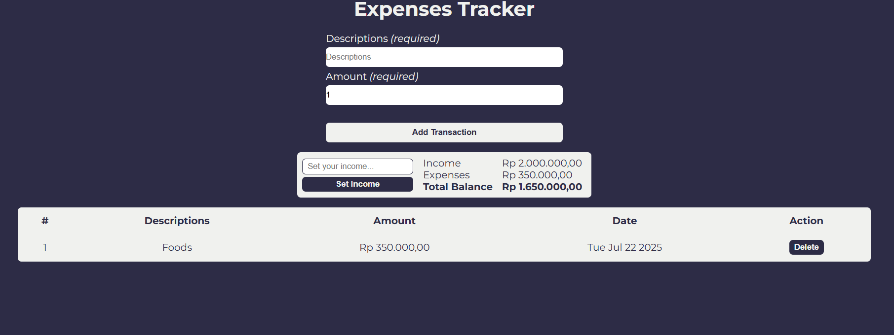

# JavaScript Practice (Expenses Tracker)

## Local Storage Practice

#### Tracking your expenses

## Preview

## Details

- Inpuy your expenses and income. It will calculate your total balance and total expenses you input
- The data will be saved in your browser. When you reload the web, all of the data that been saved will be shown in the page immediately.
- Currency displayed is in IDR (Indonesian Rupiah)\*

(\*) You can change the currency and number formatting the same with your country, I commented pretty much everything in the code

## What I Learn

Handling the logic, saving inputted data to local storage and serve the data to page is quite tricky for me. Updating UI when the page is loaded took hours for me to solve but in the end I managed to handle that even though I'm really sure mine is messy and there is more effective way to do it.
